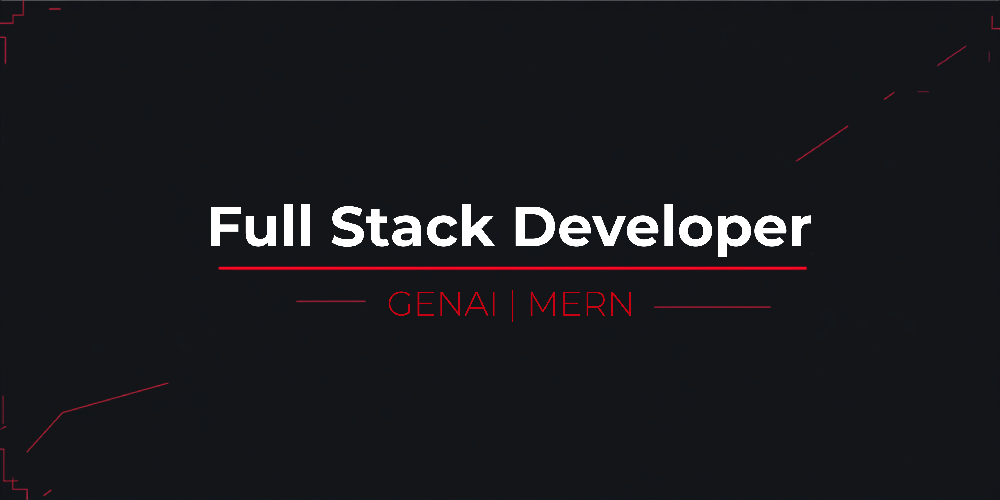

<!-- ═══════════════════════════════════════════════════════════════════════════════ -->
<!--                    ⚠️ SYSTEM BREACH — UNAUTHORIZED ACCESS DETECTED              -->
<!-- ═══════════════════════════════════════════════════════════════════════════════ -->

  

https://git.io/typing-svg

  
  

<!-- ═══════════════════════════════════════════════════════════════════════════════ -->
<!--                              IDENTITY MATRIX                                   -->
<!-- ═══════════════════════════════════════════════════════════════════════════════ -->
<h2 align="center">
  ◈ IDENTITY MATRIX ◈
</h2>

plain
┌─────────────────────────────────────────────────────────────┐
│  OPERATIVE    : Nitish Chauhan                               │
│  HANDLE       : algo-nitish                                  │
│  CLEARANCE    : B.Tech CSE (Data Science) | ABES Engg '27    │
│  SPECIALTY    : Full Stack Development | GenAI | Algorithms  │
│  COMBAT STATS : 500+ DSA Solved | CodeChef 3★ | LeetCode    │
│  STATUS       : Active — Seeking SDE / Full Stack Roles      │
└─────────────────────────────────────────────────────────────┘

  

<!-- ═══════════════════════════════════════════════════════════════════════════════ -->
<!--                           ARSENAL — CONFIRMED SYSTEMS                            -->
<!-- ═══════════════════════════════════════════════════════════════════════════════ -->
<h2 align="center">
  ◈ ARSENAL — CONFIRMED SYSTEMS ◈
</h2>

<h3>⚡ CORE PROTOCOLS</h3>

  
  
  
  

<h3>🌐 FRONTEND MATRIX</h3>

  
  
  
  
  

<h3>⚙️ BACKEND PROTOCOLS</h3>

  
  
  
  
  

<h3>🤖 AI / GENAI MODULES</h3>

  
  
  

<h3>🛠️ DEVTOOLS</h3>

  
  
  
  
  

<!-- ═══════════════════════════════════════════════════════════════════════════════ -->
<!--                         BATTLEFIELD STATISTICS                                 -->
<!-- ═══════════════════════════════════════════════════════════════════════════════ -->
<h2 align="center">
  ◈ BATTLEFIELD STATISTICS ◈
</h2>

  
  

  

  

<!-- ═══════════════════════════════════════════════════════════════════════════════ -->
<!--                        COMPETITIVE WARFARE LOGS                                 -->
<!-- ═══════════════════════════════════════════════════════════════════════════════ -->
<h2 align="center">
  ◈ COMPETITIVE WARFARE LOGS ◈
</h2>

Table
PLATFORM	STATUS	ACHIEVEMENT
LeetCode	ACTIVE	500+ Problems Solved
CodeChef	ELITE	3★ Rating
GeeksforGeeks	VETERAN	DSA Mastery

  

<!-- ═══════════════════════════════════════════════════════════════════════════════ -->
<!--                         CLASSIFIED OPERATIONS                                  -->
<!-- ═══════════════════════════════════════════════════════════════════════════════ -->
<h2 align="center">
  ◈ CLASSIFIED OPERATIONS ◈
</h2>

plain
┌────────────────────────────────────────────────────────────────────────────┐
│  [TOP SECRET] OPERATION: HANDSHAKE AI EVALUATION                           │
│  ├─ ROLE     : AI Software Evaluation Contributor                            │
│  ├─ DURATION : May 2026 — Present                                            │
│  ├─ LOCATION : Remote                                                          │
│  ├─ MISSION  :                                                                 │
│  │   • Benchmark LLM reasoning capabilities                                    │
│  │   • Analyze complex codebases, identify bugs                                │
│  │   • Validate AI-generated solutions for correctness & robustness            │
│  │   • Repository-level coding: debugging, code understanding                  │
│  │   • Projects: DYNAMO | LOTUS                                               │
│  │   • Human-in-the-loop evaluation for real-world SE performance               │
│  └─ STATUS   : ACTIVE                                                        │
├────────────────────────────────────────────────────────────────────────────┤
│  OPERATION: IBM DEVELOPER SKILLS NETWORK                                     │
│  ├─ ROLE     : Web Developer Intern                                          │
│  ├─ DURATION : Sep 2025 — Nov 2025                                           │
│  ├─ LOCATION : Virtual                                                       │
│  ├─ MISSION  :                                                                 │
│  │   • Web Development & Responsive UI Design                                  │
│  │   • Digital Marketing Fundamentals                                         │
│  │   • Industry-oriented project workflows                                    │
│  └─ STATUS   : COMPLETED                                                     │
├────────────────────────────────────────────────────────────────────────────┤
│  OPERATION: INTERNSHALA STUDENT PARTNERSHIP                                    │
│  ├─ ROLE     : ISP (Internshala Student Partner)                             │
│  ├─ DURATION : Oct 2025 — Nov 2025                                           │
│  ├─ LOCATION : India                                                         │
│  ├─ MISSION  :                                                                 │
│  │   • Campus promotion of online trainings & internships                     │
│  │   • Social media campaigns & student upskilling                            │
│  │   • Leadership & marketing skill development                              │
│  └─ STATUS   : COMPLETED                                                     │
└────────────────────────────────────────────────────────────────────────────┘

<!-- ═══════════════════════════════════════════════════════════════════════════════ -->
<!--                         FEATURED DEPLOYMENTS                                   -->
<!-- ═══════════════════════════════════════════════════════════════════════════════ -->
<h2 align="center">
  ◈ FEATURED DEPLOYMENTS ◈
</h2>

<!-- ═══════════════════════════════════════════════════════════════════════════════ -->
<!--                         SECURE COMMUNICATION CHANNELS                          -->
<!-- ═══════════════════════════════════════════════════════════════════════════════ -->
<h2 align="center">
  ◈ SECURE COMMUNICATION CHANNELS ◈
</h2>

https://nitish-portfolio-rouge.vercel.app/
https://www.linkedin.com/in/nitish-chauhan-dev
mailto:cnitish440@gmail.com
https://github.com/algo-nitish

<!-- ═══════════════════════════════════════════════════════════════════════════════ -->
<!--                         SYSTEM TERMINATION SEQUENCE                            -->
<!-- ═══════════════════════════════════════════════════════════════════════════════ -->

  

plain
┌─────────────────────────────────────────────────────────────┐
│  SYSTEM LOG: Connection established with NITISH CHAUHAN      │
│  SYSTEM LOG: Neural interface synchronized                   │
│  SYSTEM LOG: All systems operational                         │
│  SYSTEM LOG: Awaiting next command...                        │
└─────────────────────────────────────────────────────────────┘

  

<!-- ═══════════════════════════════════════════════════════════════════════════════ -->
<!--                    END OF TRANSMISSION — HAVE A NICE DAY, OPERATOR              -->
<!-- ═══════════════════════════════════════════════════════════════════════════════ -->

  

